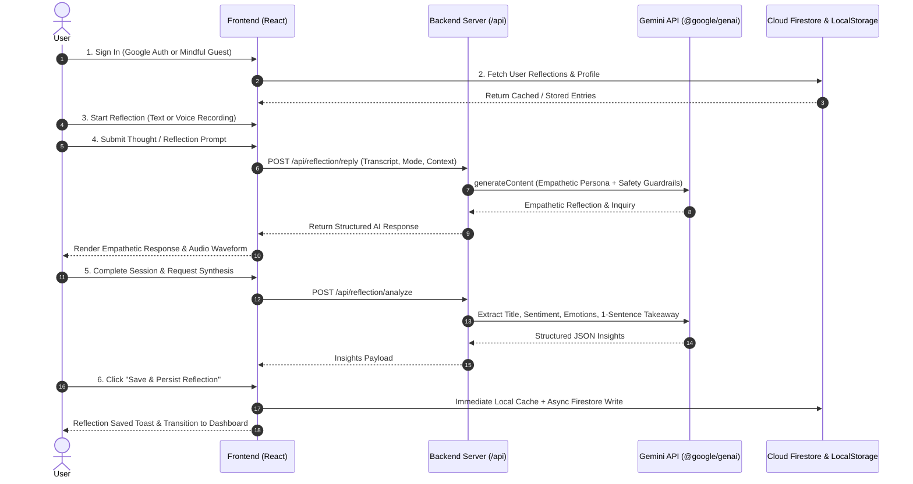

# Aura Reflect AI – Mindful AI Journal & Reflection Partner

A full-stack, user-authenticated AI journaling, voice reflection, and weekly synthesis web application built with Google GenAI (`@google/genai`), Express, React, TypeScript, Tailwind CSS, Firebase Authentication, and Cloud Firestore.

---

## 1. System Architecture & Flow Diagrams

### 1.1 End-to-End System Architecture

```mermaid
flowchart TD
    subgraph Client ["Client (React + TypeScript + Tailwind CSS)"]
        UI[User Interface / Navigation]
        Auth[Firebase Auth Provider]
        Studio[Reflection Studio & Voice Capture]
        Hist[Journal History & Detail Inspector]
        Synth[Weekly Emotional Synthesis]
        Store[(Local Storage Cache)]
    end

    subgraph Server ["Backend (Express + Node.js + Vite Engine)"]
        APIRoute["/api Proxy Routes"]
        FallbackEngine["Resilient Model Fallback Ladder"]
        Sanitizer[Payload Cleaner & Schema Validator]
    end

    subgraph GoogleCloud ["Google Cloud & Firebase Infrastructure"]
        Firestore[(Cloud Firestore /users/{uid}/*)]
        SecretMgr[Cloud Secret Manager: GEMINI_API_KEY]
        GeminiAPI["Google Gemini AI API (gemini-flash-latest / 3.7-flash)"]
        AuthService[Firebase Google Identity Auth]
    end

    UI --> Auth
    Auth <--> AuthService
    Studio --> APIRoute
    Synth --> APIRoute
    APIRoute --> Sanitizer
    Sanitizer --> FallbackEngine
    FallbackEngine <--> GeminiAPI
    SecretMgr -.-> Server
    Studio <--> Store
    Studio <--> Firestore
    Hist <--> Store
    Hist <--> Firestore
```

### 1.2 User Interaction & Reflection Lifecycle Flow



---

## 2. Agentic Threat Modeling Summary Table

| Threat Zone | Identified Attack Vector / Scenario | Countermeasure & Defensive Architecture |
| :--- | :--- | :--- |
| **Input Surfaces** | Malicious injection via voice notes, journal prompts, or unescaped HTML payloads | Strict payload decoding middleware, schema sanitization with null-stripping, prompt framing, and non-eval native rendering in React. |
| **Planning & Reasoning** | System prompt hijacking or attempts to elicit non-therapeutic clinical diagnosis | Firm empathetic persona system instructions with explicit boundary guardrails and non-clinical mindfulness scopes. |
| **Tool Execution & APIs** | API key exposure, SSRF, or unauthenticated reflection generation | Gemini API keys are strictly confined to the backend server (`server.ts`). Client routes verify ownership context. |
| **Memory & State** | Cross-tenant data exfiltration or unauthorized reading of other users' journals | Zero-trust Cloud Firestore security rules (`request.auth.uid == userId`) with user-isolated subcollections. |
| **Inter-System Communication** | Upstream Gemini API timeouts or rate limits (`429`, `503`, `500`) | Resilient fallback ladder (`gemini-flash-latest` → `gemini-3.1-flash-lite` → `gemini-3.7-flash`) with instant zero-stall failover. |

---

## 3. Cloud Firestore Security Rules

Deploy the following owner-bound rules in `firestore.rules` to enforce strict zero-trust user isolation:

```javascript
rules_version = '2';
service cloud.firestore {
  match /databases/{database}/documents {
    // Isolated user reflection interactions
    match /users/{userId}/interactions/{interactionId} {
      allow read, write: if request.auth != null && request.auth.uid == userId;
    }
    
    // User profile and private reflection subcollections
    match /users/{userId} {
      allow read, write: if request.auth != null && request.auth.uid == userId;

      match /{allSubcollections=**} {
        allow read, write: if request.auth != null && request.auth.uid == userId;
      }
    }
  }
}
```

---

## 4. Secret Manager & Environment Setup

### 4.1 Create and Store Secret in Google Cloud Secret Manager
```bash
# 1. Enable required Google Cloud APIs
gcloud services enable \
  run.googleapis.com \
  secretmanager.googleapis.com \
  firestore.googleapis.com \
  identitytoolkit.googleapis.com

# 2. Create the GEMINI_API_KEY secret in Secret Manager
gcloud secrets create GEMINI_API_KEY --replication-policy="automatic"
echo -n "YOUR_GEMINI_API_KEY" | gcloud secrets versions add GEMINI_API_KEY --data-file=-

# 3. Grant the Cloud Run default service account Secret Accessor permissions
PROJECT_NUMBER=$(gcloud projects describe $(gcloud config get-value project) --format="value(projectNumber)")
gcloud secrets add-iam-policy-binding GEMINI_API_KEY \
  --member="serviceAccount:${PROJECT_NUMBER}-compute@developer.gserviceaccount.com" \
  --role="roles/secretmanager.secretAccessor"
```

---

## 5. How to Run & Test Locally

### 5.1 Prerequisites
- **Node.js**: v18.0.0 or higher
- **npm**: v9.0.0 or higher
- **Gemini API Key**: Obtain one from [Google AI Studio](https://aistudio.google.com/)

### 5.2 Step-by-Step Local Setup

1. **Clone the repository**:
   ```bash
   git clone https://github.com/your-username/aura-reflect-ai.git
   cd aura-reflect-ai
   ```

2. **Install dependencies**:
   ```bash
   npm install
   ```

3. **Configure Environment Variables**:
   Create a `.env` file in the project root based on `.env.example`:
   ```env
   # Server-side Secret (Required for Gemini AI features)
   GEMINI_API_KEY=AIzaSyYourActualGeminiApiKeyHere

   # Optional Custom Port (defaults to 3000)
   PORT=3000
   ```

4. **Start the Unified Development Server**:
   ```bash
   npm run dev
   ```
   The application will start on `http://localhost:3000`.

5. **Build and Test Production Bundle Locally**:
   ```bash
   npm run build
   npm start
   ```

---

## 6. Complete Repository Project Guide

### 6.1 Directory & File Layout

```
├── .env.example                     # Reference template for required environment variables
├── index.html                       # HTML5 template with Lucide icons & Google Fonts pairing
├── package.json                     # Node.js dependencies and lifecycle scripts
├── tsconfig.json                    # Strict TypeScript compiler options
├── vite.config.ts                   # Vite configuration with Tailwind CSS integration
├── server.ts                        # Full-Stack Express backend proxy & Gemini AI Engine
└── src/
    ├── main.tsx                     # React root initialization and error boundary trap
    ├── App.tsx                      # Main app shell, navigation router, and modal coordinator
    ├── index.css                    # Tailwind CSS imports and custom design theme variables
    ├── types.ts                     # TypeScript shared interfaces, models, and emotion types
    ├── lib/
    │   ├── firebase.ts              # Firebase Auth & Firestore client with timeout resilience
    │   └── gemini-client.ts         # Client-side API fetchers for backend AI endpoints
    └── components/
        ├── AuthView.tsx             # Google Sign-In & Mindful Guest access screen
        ├── DashboardView.tsx        # Sentiment analytics, quick prompt cards, and activity stats
        ├── HistoryView.tsx          # Filterable, searchable timeline with delete confirmation
        ├── Navbar.tsx               # Header with navigation tabs, user badge, and account menu
        ├── ReflectionDetailModal.tsx# Comprehensive dialogue view with inline delete & export
        ├── ReflectionRoom.tsx       # Live voice/text conversational reflection studio
        ├── SentimentBadge.tsx       # Visual chip rendering emotion colors and mood icons
        └── WeeklySynthesisView.tsx  # Multi-entry emotional aggregation & growth trajectory
```

### 6.2 Key Technology Stack

- **Frontend**: React 18, TypeScript, Tailwind CSS v4, Lucide React Icons
- **Backend**: Express.js, Node.js, `tsx` (runtime TypeScript), `esbuild` (bundler)
- **AI / LLM**: Google GenAI TypeScript SDK (`@google/genai`) with fallback ladders
- **Authentication**: Firebase Authentication (Google Sign-In & Federated Identity)
- **Storage**: Multi-tier persistence (Google Cloud Firestore + Browser LocalStorage fallback)

### 6.3 Backend API Endpoints

| Endpoint | Method | Purpose | Input Payload |
| :--- | :--- | :--- | :--- |
| `/api/health` | `GET` | Health check & readiness probe | None |
| `/api/reflection/reply` | `POST` | Generates empathetic dialogue responses | `{ transcript, prompt, mode, history }` |
| `/api/reflection/polish` | `POST` | Polishes raw voice transcripts into prose | `{ text, tone }` |
| `/api/reflection/analyze` | `POST` | Extracts sentiment, emotions, and takeaways | `{ fullText, prompt, history }` |
| `/api/synthesis/weekly` | `POST` | Compiles weekly emotional trends & habits | `{ entries: ReflectionEntry[] }` |

---

## 7. Google Cloud Run Deployment

Deploy the full-stack container directly using `gcloud run deploy`:

```bash
# 1. Build and deploy to Cloud Run
gcloud run deploy aura-reflect-ai \
  --source . \
  --platform managed \
  --region asia-southeast1 \
  --allow-unauthenticated \
  --set-secrets GEMINI_API_KEY=GEMINI_API_KEY:latest \
  --set-env-vars NODE_ENV=production

# 2. Apply mandatory challenge verification label
gcloud run services update aura-reflect-ai \
  --update-labels=dev-tutorial=cloud-run-ai-challenge \
  --region=asia-southeast1
```

---

## 8. Functional Walkthrough & Testing Protocol

### Test Case 1: Authentication & Zero-Trust Access
1. Visit `http://localhost:3000`. Notice unauthenticated users cannot access dashboard metrics or past reflection records.
2. Click **"Sign in with Google"** (or **"Explore Demo Mode"** for instant sandbox testing).
3. Confirm the session switches to the private dashboard with the user's name and ownership badge.

### Test Case 2: Multi-Turn AI Reflection Dialog
1. On the dashboard, click **"Start New Reflection"** or select a prompt starter (e.g., *Untangling Anxiety & Overwhelm*).
2. Type an initial thought: `"I felt overwhelmed with multiple conflicting priorities at work today."`
3. Click **"Send Thought"**. Verify Gemini responds with empathy, cognitive reframing, and an open inquiry.
4. Reply with an answer to Gemini's question. Confirm the multi-turn conversational history is maintained.

### Test Case 3: Voice Note Journaling & AI Polish
1. In the Reflection Studio, click **"Record Voice"**.
2. Speak your reflections into the microphone. Observe the active listening indicator and live transcript capture.
3. Click **"Stop Voice Note"** and click **"Polish Prose"** to format speech into polished journal prose.

### Test Case 4: Automated Sentiment Analysis & Persistence
1. In the active session, click **"Finish & Extract Insights"**.
2. Confirm Gemini extracts a 3-5 word title, primary emotion badge (e.g., *Reflective 🌿*), sentiment score, thematic tags, and 1-sentence takeaway anchor.
3. Edit the title or tags if desired, then click **"Save & Persist Reflection"**.
4. Confirm toast notification and verify the entry appears in both the Dashboard and Past Reflections.

### Test Case 5: History Search, Filter & Deletion
1. Navigate to **"History"** in the top navigation.
2. Filter by emotion (e.g., *Peaceful*, *Reflective*) or search by keyword.
3. Click on any reflection card to open the **Reflection Detail Modal** and inspect the full multi-turn dialog.
4. Click the **Trash** icon to trigger the delete confirmation modal, and confirm permanent removal.

### Test Case 6: Weekly Emotional Synthesis Generation
1. Navigate to **"Weekly Synthesis"** in the top navigation.
2. Click **"Generate Weekly Synthesis"**.
3. Verify Gemini aggregates all entries from the past 7 days, charting emotional trajectory, key breakthroughs, and actionable mindfulness habits.

